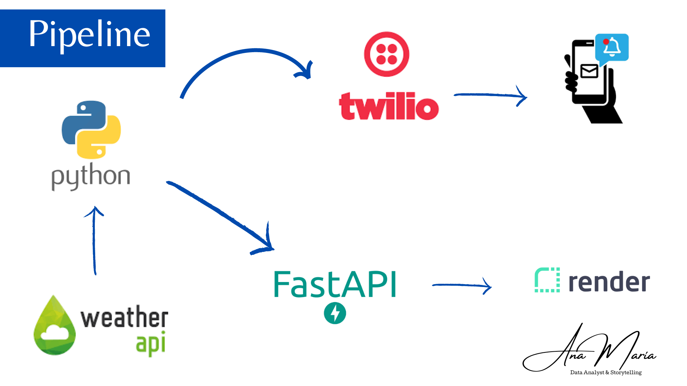

# Proyecto: Pronóstico del Tiempo con Twilio y FastAPI




## Descripción

Este proyecto tiene como objetivo brindar un servicio de consulta del pronóstico del tiempo a través de mensajes de texto enviados desde un dispositivo celular adquirido mediante [Twilio](https://console.twilio.com/). La información del pronóstico del tiempo se obtiene utilizando código Python que interactúa con la [API de Weather](https://www.weatherapi.com/).

## Funcionamiento

1. **Recepción de Mensajes**: Los usuarios pueden enviar mensajes de texto desde sus dispositivos celulares a través de Twilio, solicitando información sobre el pronóstico del tiempo en una ubicación específica. Esta parte se realiza manualmente desde el notebook [Explicación Twilio.ipynb](ruta_del_notebook/Explicación%20Twilio.ipynb) o interfaz de administración.

2. **Procesamiento en Python**: Utilizando Twilio, los mensajes recibidos se redirigen a nuestro sistema. Luego, mediante código en Python, se extrae la ubicación deseada del mensaje y se realiza una solicitud a la API de Weather para obtener los datos meteorológicos correspondientes.

3. **FastAPI Framework**: Hemos implementado un servidor FastAPI que ofrece diversos endpoints para consultar el pronóstico del tiempo en diferentes fechas, horas y lugares. Este framework nos permite manejar las solicitudes de los usuarios y proporcionar respuestas precisas y rápidas.

    Ver [Funcionamiento de la API desde la Web](https://pronostico-del-tiempo.onrender.com/docs)

## Características Principales

- **Interfaz Amigable**: Los usuarios pueden obtener información meteorológica simplemente enviando mensajes de texto, lo que facilita su acceso a los datos del pronóstico del tiempo.

- **Flexibilidad en Consultas**: Mediante el uso de endpoints en FastAPI, los usuarios pueden obtener pronósticos para diferentes fechas y horas, así como para ubicaciones variadas.

- **Automatización**: Aunque la recepción de mensajes no está completamente automatizada en este punto, el proceso de obtención y entrega de datos es automatizado a partir de la ubicación proporcionada. Una vez que se recibe una solicitud, el sistema procesa la información y envía la respuesta adecuada al usuario.

- **Integración de Twilio y Weather API**: La combinación de Twilio para la comunicación y la API de Weather para la obtención de datos garantiza un flujo de trabajo completo y eficiente.

## Tecnologías Utilizadas

- [Twilio](https://console.twilio.com/): Para la recepción y envío de mensajes de texto desde y hacia dispositivos celulares.

- **Python**: Utilizado para escribir el código que procesa los mensajes, realiza solicitudes a la API de Weather y proporciona respuestas a través de FastAPI.

- **FastAPI**: Framework que nos permite crear endpoints para manejar las solicitudes de los usuarios y entregar respuestas de manera rápida y efectiva.

- [Weather API](https://www.weatherapi.com/): Fuente de información para obtener datos precisos sobre el pronóstico del tiempo en diferentes ubicaciones.

## Conclusión

Mediante la integración de Twilio, Python y la API de Weather en un proyecto basado en FastAPI, logramos brindar a los usuarios un acceso sencillo y conveniente al pronóstico del tiempo. Aunque la recepción de mensajes no está completamente automatizada en este punto, el proyecto demuestra cómo la combinación adecuada de diferentes tecnologías puede dar lugar a una solución útil y automatizada que satisface las necesidades de información de los usuarios de manera eficiente.

### ¡No dudes en contactarme! 📬

Estoy disponible en LinkedIn para colaborar en proyectos con un impacto real. **¡Conéctate conmigo y hagámoslo posible!** 🤝

📧 Correo electrónico: anamariagarcia093@gmail.com

[](https://www.linkedin.com/in/anamaria1993/)


--------------------------------------------------------------------------------------------------------------

## Clonar Repositorio

**Abra la consola CMD desde el buscador y pegue ese script para clonar Repositorio**

```bash
git clone https://github.com/Nany1993/Pronostico_del_tiempo

